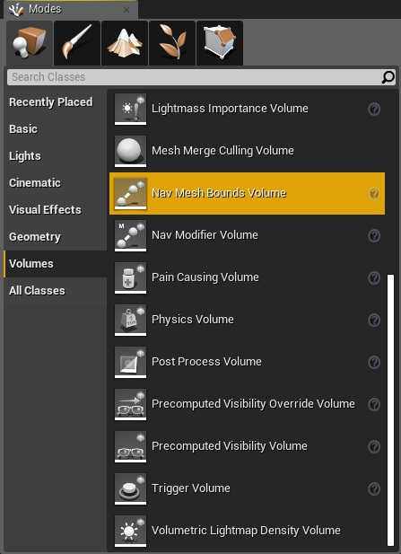
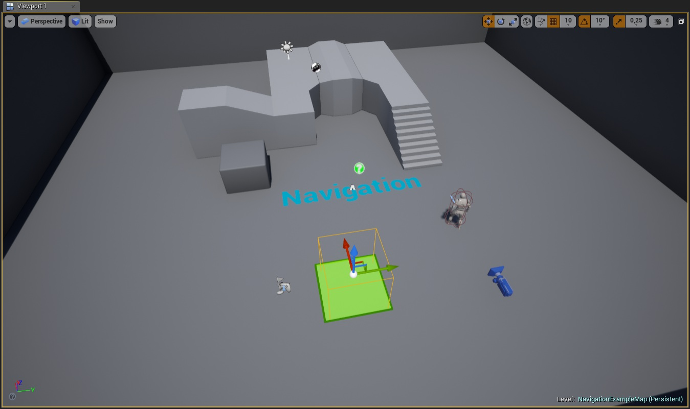
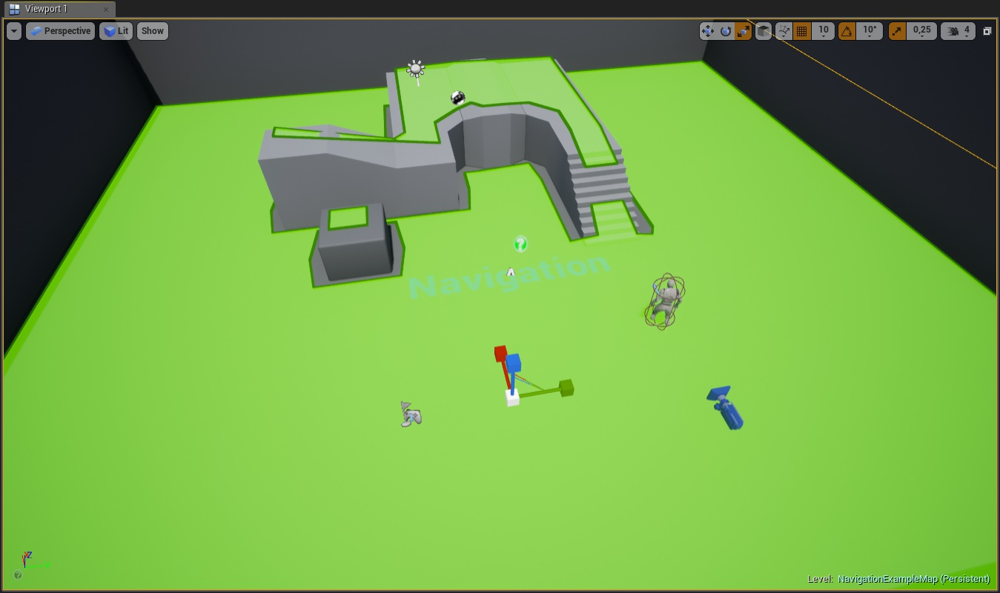
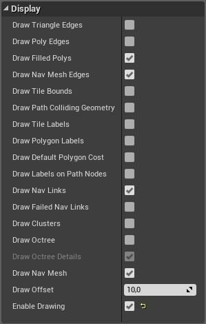
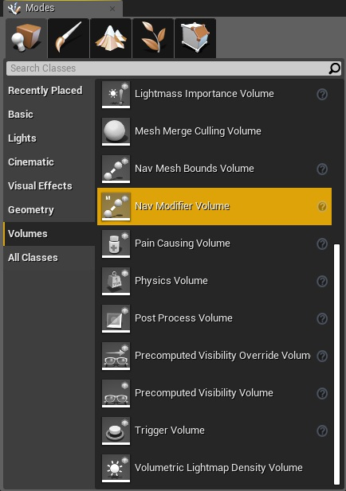
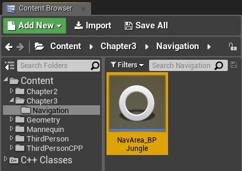
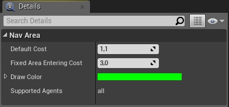
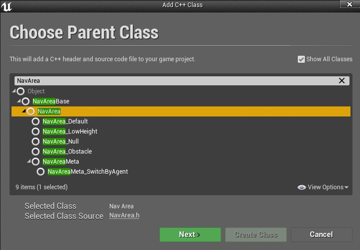
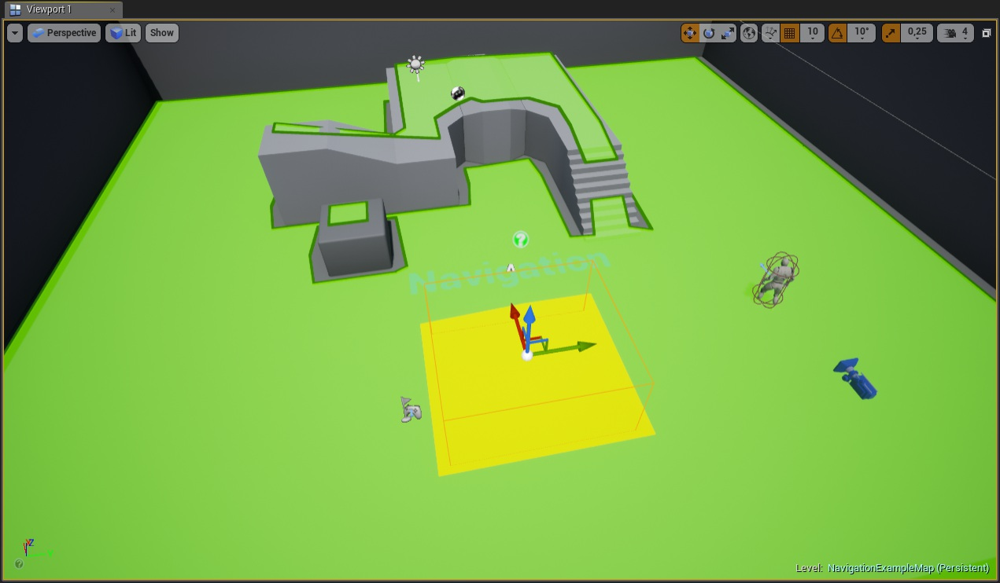

# Hands-On Artificial Intelligence with Unreal Engine中文版
# 《动手学虚幻引擎中的AI》0.1粗糙版本
# 目录
* 暂时不写
# 第一部分：虚幻引擎框架
在这一部分，我们将深入探索虚幻引擎中的AI框架。我们将从什么是行为树和黑板开始，学习导航系统、环境查询系统和感知系统。在这部分的结尾，我们还将了解如何通过创建自定义任务、装饰器和服务，如何处理大量人群，以及如何扩展（蓝图和C++）行为树。
本部分将涵盖以下章节：
- 第一章 迈向AI世界的第一步
- 第二章 行为树和黑板
- 第三章 导航
- 第四章 环境查询系统
- 第五章 代理感知
- 第六章 扩展行为树
- 第七章 集群
# 第一章 迈向AI世界的第一步
从bronze giant Talos，到符号系统和神经网络：人工智能是如何被塑造和用于电子游戏的。

各位读者，欢迎来到人工智能（简称AI）之旅的开始。你有没有想过那些在魔兽世界辛勤工作的peons是如何探索复杂的地图的？或者，那些在《吃豆人》里神采奕奕的鬼魂怎么能把你带到任何地方？或者你的对手在最终幻想中如何优化他们的攻击来屠杀你的队伍？


那你就来对地方了！
在本章中，我们将探讨成为一个人工智能游戏开发者的先决条件，以及人工智能在游戏开发流程中的应用。然后，我们会回顾一下AI在电子游戏中的发展历史，并了解许多大佬的共同努力如何构建了我们今天所知的人工智能。之后，我们将讨论在虚幻引擎下的人工智能框架，因为这本书将集中讨论虚幻。

最后，我们将计划我们的学习路线，并获得本书不同章节所涉及主题的总体概述。

## 正式开始前
我想回答一些你们可能已经有的问题。

**这本书是使用蓝图还是C++ ?**  
这本书将会讲解两者，所以不用担心。

如果你不知道C++，你可以跟着这本书的蓝图部分，如果你愿意，你可以试试C++。

另一方面，如果你是一个喜欢c++的程序员，那么不要担心！这本书将解释如何处理人工智能在虚幻中使用c++。

**关于人工智能的书这么多，我为什么要选这本呢?**  
不同的书籍解释了人工智能的不同方面，它们通常不是相互排斥的，而是相辅相成的。  

然而，这本书的主要兴趣点是，它是一个在不同的人工智能系统的理论存在于虚幻和实际应用之间的妥协，因为整本书充满了具体的例子。

**这本书提供了一个测试项目吗?**  
必须滴。您将能够从以下链接下载本书的内容:http://hog.red/AIBook2019ProjectFiles (链接区分大小写)。

**我已经在使用虚幻引擎的AI了，这本书对我有好处吗？**  
这完全取决于你的知识水平。事实上，在这本书的第一部分，我们将主要谈论如何使用内置在虚幻引擎中的人工智能框架。这可能是你更熟悉的部分，如果你有一些虚幻中AI的经验。然而，这本书将深入探讨这些话题，甚至专家可以找到一些有用的提示。第二部分将讨论一些游戏AI的调试方法，并进行解释如何扩展它们(主要是用c++)。请随意看一看大纲，然后决定这本书是否适合你。

**我已经在使用另一个游戏引擎了，这本书还适合我吗?**  
好吧，尽管我想说这是一本关于人工智能的通用书籍，但它不是——至少不完全是。虽然主要的焦点仍然是人工智能的主要概念，我们将着眼于在虚幻中实现它们。然而，这本书将严重依赖于在虚幻内置的AI框架。因此，我鼓励您阅读更多关于AI的一般性书籍，以获得更好的理解。另一方面，你可以随时尝试。也许，通过理解这里的一些概念，其他的书将更容易阅读，你将能够将这些知识转移到你所选择的游戏引擎中。

**我是学生/老师，这本书适合在课堂上教学吗？**  
必须滴。我知道在课堂上找到好的资源是多么重要，我写这本书的目的就是为了这个。因此，不管你是学生还是老师，你都会在每一章的末尾找到一个部分，里面有一些练习，你可以通过这些练习来提高你的技能(如果你是老师，也可以向你的学生推荐这些练习)。此外，你可以在这里找到更多的综合材料:http://hog.red/AIBook2019LearningMaterial (链接区分大小写)。

**这本书会涵盖所有，所有，所有关于人工智能在虚幻和所有系统的一切吗?**  
好吧，尽管我尽了最大的努力来详细描述每个系统，但是由于如此庞大的引擎的复杂性，覆盖所有内容是一项不可能完成的任务。然而，我敢说这本书涵盖了与虚幻引擎中每个AI系统相关的大部分方面，包括如何扩展内置系统以及如何高效地执行调试。因此，我可以肯定地说，这本书是非常全面的。

## 预备知识
因为这本书是针对那些刚开始在游戏开发中使用AI的人，所以我不会假设任何关于AI的知识。但是，请考虑以下因素:

- 蓝图用户:您应该熟悉蓝图编程，并了解蓝图的一般工作方式。

- C++用户:您应该熟悉编程，尤其是C家族语言(如C、c#、c++，甚至Java)，特别是用C++，因为它是虚幻引擎使用的语言。熟悉虚幻引擎C++API是一个优势，虽然不是要求不高。所以，即使你不是大佬，也不要担心——跟着学，你就能够学会。  

此外，如果你对向量数学和物理运动学原理有一些了解就好了——至少是在视频游戏中常用的那些。不管怎样，如果你对这些感到生疏，不要太担心，因为这本书不需要;不过，如果你想找一份做AI开发的兼职工作，这也是个不错的选择。

## 安装软件
在你继续阅读之前，让我们先安装我们需要的软件——虚幻引擎和Visual Studio。

### 虚幻引擎
让我们谈谈虚幻引擎。毕竟，这是一本关于如何在这个出色的游戏引擎中开发游戏AI的书。

虚幻引擎是一款由Epic Games公司开发的游戏引擎。它于1998年首次发布，由于它强大的功能，现在它是最常用的(开放)游戏引擎之一(与Unity一起)。如下截图为虚幻引擎主界面:


我们需要安装最新版本的虚幻引擎。你可以访问 https://www.unrealengine.com/en-us/what-unreal-enging-4 找到它。除非你选择源代码版本虚幻引擎(https://docs.unrealengine.com/en-us/Programming/Development/BuildingUnrealEngine)中，您将安装Epic启动程序。如果您是一个蓝图用户，并且不打算使用C++，那么这就足够了。另一方面，如果您将使用C++，则需要执行一些额外的步骤。

在安装引擎时，您需要检查一些选项(如果您正在使用C++)。我们需要检查是否同时具有“Engine Source”和“Editor symbols for debugging”，如下图所示：


通过这样做，我们将能够在C++引擎源代码中导航，并在崩溃的情况下拥有完整的调用堆栈(因此您将知道哪里出错了)。

### Visual Studio
如果您正在使用蓝图，则不需要这样做—这仅适用于C++用户。

事实上，我们需要一个IDE来编辑我们的c++代码。因为Visual Studio与虚幻引擎的完美结合，我们将使用Visual Studio。您将能够通过官方网站免费下载Visual Studio Community Edition，https://www.visualstudio.com，或从 https://visualstudio.microsoft.com/vs/。

您可能还会发现关于如何设置Visual Studio的简短指南:https://docs.unrealengine.com/en-us/Programming/Development/VisualStudioSetup。

一旦你安装好了所有的东西，我们就可以继续本章剩下的内容了。

## 成为一名AI游戏开发人员
你是否梦想过成为一名AI游戏开发者?或者只是能够编写“智能”程序?那么这本书是为你量身定做的!

然而，我必须告诉你，这不是一件容易的事。

游戏开发和设计是一些最广泛的艺术作品。这是因为需要大量的专业知识才能使游戏焕发生机。你可以通过观察游戏中的最终得分来了解这一点。它们是无穷无尽的，包含了许多人的名字，他们在游戏中投入了大量的时间，扮演着各种各样的角色。人工智能的发展是这个大过程的核心部分，它需要多年的时间来掌握，就像生活中的大多数事情一样。因此，迭代是关键，也是本书的一个很好的起点。

### 成为AI游戏开发者意味着什么
首先，你需要掌握数学、物理和编程。此外，您很可能会在一个跨学科的团队中工作，其中包括艺术家、设计师和程序员。事实上，您可能会使用现有的专有软件技术，并且需要能够构建新技术来满足项目的技术需求。您将被要求研究编码技术和算法，以使自己跟上游戏行业的技术发展和进步，并识别技术和开发风险/障碍，并得出解决方案来解决已知的风险。

另一方面，你将能够在电子游戏中赋予角色和实体生命。在经历了所有的挫折之后，你将是第一个帮助或更好地在游戏中创造出智能行为的人。这需要时间，也很有挑战性，所以在早期阶段不要对自己太苛刻。一旦你在游戏中实现了一些真正的能够独立思考的AI，这便是一种值得奖励的成就。

对于人工智能的初学者来说，这本书将帮助你朝着这个目标迈出第一步。对于专家来说，这本书将提供一个有用的指南来学习在虚幻中不同的人工智能系统，并深入探索，可能有助于您的工作。

### 游戏开发过程中的AI
游戏开发流程可能会有很大的不同，这取决于您的工作室，但是所有这些流程都会创建一个电子游戏。这不是一本关于流程的书，所以我们不会去探索它们，但是对于AI的配置有一个大致的概念是很重要的。

事实上，AI与游戏开发流程的许多部分是交叉的。这里是一些主要的：
- **动画**：这可能会让你们中的一些人感到惊讶，但是有很多关于这个话题的研究正在进行中。有时候，动画和AI会重叠。例如，开发人员需要解决的问题之一是如何程序化地为角色生成数百个动画，这些动画可以真实地表现，以及它们之间如何交互。事实上，解决逆向运动学(IK)是一个数学问题，但在无限的解决方案中选择哪一个来实现目标(或只是提供一个现实的外观)是一个人工智能任务。在本书中我们不会遇到这个具体的问题，但是最后一章将提供一些观点，您可以在其中了解更多关于这个问题的信息。

- **关卡设计**：如果一款游戏自动生成关卡，那么AI便会在该游戏中扮演重要角色。程序内容生成(PCG)是当前游戏领域的一个热点问题。有些游戏完全基于PCG。
不同的工具程序生成高度地图可以帮助水平设计师实现了逼真的景观和环境。这确实是一个值得探讨的广泛话题。

- **游戏引擎**：当然，在游戏引擎中，有许多AI算法在起作用。其中一些是专门针对代理的，而其他的只是改进引擎的特性和/或任务。这些代表了最广泛的类别，它们可以从简单的算法根据上下文调整Bezier曲线，到为动画实现行为树或有限状态机。在引擎外表下，这里发生了很多事情。我们将在本书中探讨其中的一些概念，但要记住的是，算法可以用来解决类似的问题在不同的领域。事实上，如果使用有限状态机(FSMs)来做决策，为什么不使用它们来“决定”要播放哪个动画呢?或者为什么不处理整个游戏逻辑(即虚幻引擎中的蓝图可视化脚本)?

- **NPCs**：这是游戏中的AI的最明显的例子，这也是玩家最明显的AI(我们将在第一章中探讨更多关于AI和玩家之间的关系)。这是这本书的大部分重点;也就是说，从移动角色(例如，使用寻路算法)到做出决策(例如，使用行为树)，或者与其他npc(多代理系统)协作。

不幸的是，我们没有足够的空间来处理这本书中的所有主题。因此，我们将只关注最后一部分(npc)，并探索内置在虚幻引擎中的人工智能框架。

## 简史
在开始我们的学习之前，我相信对AI和AI在游戏中的历史有一个大致的概述是有益的。当然，如果你是一个动手能力更强的人，你可以跳过这一部分，因为你已经等不及要开始编写人工智能程序了。

### 什么是AI？
这是一个非常有趣的问题，它没有唯一的答案。事实上，不同的答案会导致不同方面。让我们探索一下不同学者(按时间顺序)给出的一些(许多)定义。  

事实上，Russell和Norvig在他们的书中，将这些特定的定义分为四类。这是他们的模式:


Russell和Norvig的四个类别。左上:“像人类一样思考的系统”。右上:“理性思考的系统”。左下:“像人类一样的系统”。右下:“行为理性的系统”。

我们没有时间详细讨论“什么是AI?”这个问题，但这本书的最后一章也将包括一些哲学参考，在这个主题你可以拓展你的知识。

### 往事一瞥
你们中的一些人可能会感到意外，但人工智能的故事早在电脑出现之前就已经开始了。事实上，甚至古希腊人也假设存在智能机器。一个著名的例子是bronze giant Talos，他保护的城市克里特岛的入侵者。另一个是赫菲斯托斯的黄金帮手，他在火山中帮助上帝和独眼巨人一起锻造。在十七世纪，雷内笛卡尔曾写过关于会思考的机器人的文章，他认为动物与机器不同，机器可以用滑轮、活塞和凸轮来复制。

然而，这个故事的核心开始于1931年，当奥地利逻辑学家、数学家和哲学家科特·哥德尔证明了所有一阶逻辑的真实陈述都是可推导的。另一方面，这对于高阶逻辑是不正确的，在高阶逻辑中，一些正确(或错误)的陈述是无法证明的。这使得一阶逻辑成为自动化派生逻辑结果的良好候选。听起来复杂吗?好吧，你可以想象这在他的传统主义同龄人的耳朵里是怎么听来的。


1937年，英国计算机科学家、数学家、逻辑学家、密码分析员、哲学家和理论生物学家艾伦·图灵（Alan Turing）指出了“智能机器”的一些局限性：除非程序实际运行，否则无法预知它是否会终止。这在理论计算机科学中有许多结果。然而，最基本的一步发生在13年后的1950年，当时艾伦·图灵写了一篇著名的论文《Computing Machinery and Intelligence》，在这篇论文中他谈到了模仿游戏，现在主要被称为“图灵测试”：一种定义什么是智能机器的方法。

20世纪40年代，人们曾尝试模拟生物系统:1943年，麦卡洛克和皮茨建立了神经元的数学模型,1951年，明斯基发明了一种能够用3000个真空管模拟40个神经元的机器。然而，他们陷入了困境之中。

从20世纪50年代末到80年代初，大部分的人工智能研究都是致力于“符号系统”。它们基于两个组件:一个由符号组成的知识库和一个推理算法，后者使用逻辑推理来操作这些符号，以扩展知识库本身。

在这一时期，许多大佬取得了重大的进步。值得一提的是麦卡锡（McCarthy），他于1956年在达特茅斯学院（Dartmouth College）组织了一次会议，在那里“人工智能”一词最早诞生。两年后，他发明了高级编程语言LISP，第一批能够自我修改的程序就是在LISP中编写的。其他显著的成果包括1959年Gelernter的几何定理证明，1961年Newell和Simon的通用问题求解器（GPS），以及Weizenbaum的著名聊天机器人Eliza，这是1966年第一个可以用自然语言进行对话的软件。最后，随着法国科学家阿兰·普罗格的发明，符号系统在1972年达到了顶峰。

符号系统引出了许多AI技术，这些技术仍然在游戏中使用，例如黑板架构、寻路、决策树、状态机和转向算法，我们将在本书中探索所有这些技术。

这些系统的权衡是知识和搜索之间的权衡。你拥有的知识越多，你需要搜索的知识就越少，你搜索的速度越快，你需要的知识就越少。这已经被数学证明了Wolpert和Macready在1997年。我们将有机会在本书后面更详细地研究这种取舍。

20世纪90年代初，符号系统变得不充分，因为它们很难扩展到更大的问题。同时，也有一些哲学上的争论反对他们，认为符号系统是一个不相容的有机智能模型。因此，受到生物学启发的新老技术得到了发展。随着1986年Nettalk的成功，旧的神经网络被重新拾起。Nettalk是一个能够学习大声朗读的程序，同年鲁梅尔哈特和麦克莱伦德出版了《并行分布式处理》一书。事实上，“反向传播”算法被重新发现了，因为它们允许使用神经网络(NN)真正学习。

在人工智能的近30年里，研究有了新的方向。Pearl在“Probabilistic reasoning in intelligent systems”的工作中，采用了概率作为处理不确定性的主要工具之一。因此，人工智能开始使用许多统计技术，如贝叶斯网络、支持向量机
(SVMs)、高斯过程和马尔可夫隐模型，广泛用于表示系统状态的时间演化。此外，大型数据库的引入开启了人工智能的许多可能性，一个名为“深度学习”的全新分支应运而生。

然而，重要的是要记住，即使人工智能研究人员发现了新的和更先进的技术，旧的不能被丢弃。事实上，我们将会看到，如何根据问题和它的大小，一个特定的算法可以发光。

### 游戏中的AI
电子游戏中人工智能的历史和我们在前一节中讨论的一样有趣。我们没有时间去详细地分析每一款游戏，以及每一款游戏的贡献。对于你们中最好奇的人来说，在本书的结尾，你会发现其他的演讲、视频和书籍可以让你更深入地研究游戏中的AI历史。

电子游戏中的第一种形式的人工智能是基础的，并用于像乒乓球这样的游戏中
[雅达利，1972]，太空入侵者[中途游戏西部公司，1978]，等等。事实上，除了移动球拍试图接住球，或将外星人推向玩家，我们能做的就不多了:


第一个使用明显人工智能的著名游戏是《吃豆人》(Pac-Man)。这四个怪物(后来由于雅达利2600的一个闪烁的端口而被命名为鬼魂)使用FSM追逐(或逃离)玩家:


在20世纪80年代，游戏中的AI并没有太大的改变。直到《魔兽争霸:人类与兽人》的问世[暴雪娱乐，1994]，一个寻路系统才得以在一款电子游戏中成功实现。我们将在第3章“导航”中探索虚幻中的导航系统:


可能是《黄金眼007》让人们开始对人工智能产生了兴趣[Rare Ltd.， 1997]，它展示了AI如何改善游戏玩法。虽然它仍然依赖FSMs，但创新之处在于角色可以看到彼此，并采取相应的行动。我们将在第五章Agent中探讨Agent Awareness。这在当时是一个热门话题，一些游戏将其作为主要的游戏机制，如《小偷:黑暗计划》和《合金齿轮》。


另一个热门话题是模拟士兵在战斗中的情绪。其中的一个第一个实现情感模式的游戏是《战锤:黑暗》但它只是与幕府将军:全面战争这些模型在没有性能问题的大量士兵身上获得了极大的成功:


一些游戏甚至将AI作为游戏玩法的核心。虽然最早这样做的游戏之一是Creatures [Cyberlife Technology Ltd.， 1997]，但这一概念在《模拟人生》或Black and White等游戏中更为明显：


在过去的20年里，许多人工智能技术被采用和/或开发。然而，如果游戏不需要高级AI，你可能会发现FSMs仍然被广泛使用，还有行为树，我们将在第二章“行为树和黑板”中开始探讨。

### 游戏中的AI-工业和学术界
当谈到应用于电子游戏的人工智能时，无论是在学术界还是在业界，都存在很大的差异。让我们来看看背后的原因。事实上，他们有不同的目标。

学术界希望为那些能够在环境中进行**智能思考**并与玩家互动的游戏创造AI代理。

另一方面，游戏产业想要为那些能够在环境中进行好像能智能思考并与玩家互动的游戏创造AI代理。（有问题）

我们可以清楚地注意到，第一个导致一个更现实的AI，而第二个导致一个更可信的AI。当然，商业游戏更担心的是后者而不是前者。

我们将在第14章“超越”中更详细地探讨这一概念，当我们讨论为游戏创造AI系统所涉及的心理学和游戏设计时。事实上，为了达到一个可信的行为，你经常需要努力做到真实。

然而，在更正式的术语中，我们可以说游戏AI属于弱AI(与强AI相反)，它专注于智能地解决特定的任务或问题，而不是在其背后发展一种意识。在任何情况下，我们都不会再深入探讨这个问题。

## 学习计划
在进入下一章之前，是时候开始计划我们的学习路线了。

### 专业用语
因为，对你们中的一些人来说，这是你们第一次接触人工智能，所以你有一个贯穿本书的技术术语的小词汇表是很重要的(一般来说，在人工智能中)在过去的几页中，我们已经遇到了其中一些问题:

- **Agents**是能够自主推理解决特定目标集的系统。
- **Backward Chaining**是通过逆向工作来跟踪问题原因的过程。
- **Blackboard**是用于在不同代理之间交换数据的架构，有时甚至在代理本身内部交换数据(特别是在Unreal中)。
- **Environment**是一个代理存在的世界。例如，游戏世界是来自同一款游戏的NPC的环境。另一个例子是国际象棋棋盘，它表示与人类(或其他系统)对弈的系统的环境。
- **Forward Chaining**，与反向链接相反，是向前查找问题的解决方案的过程。
- **Heuristic**是解决问题的一种实际方法，它不能保证是最优的，也不能满足当前的目标。启发式方法用于寻找问题的最优解是不切实际的(如果不是不可能的话)，以找到一个满意的解决方案。它们可以被认为是减轻决策过程中认知负荷的心理捷径。有时，它可以表示基于agent过去经验的知识(尽管这通常是先验的)。“启发式”一词源于古希腊，意为“发现”或“发现”。

### 自下而上的模式
通常，当一个系统被建立或研究时，有两种主要的方法:自上而下和自下而上。前者从系统的高层结构开始，逐步进入系统的粒度细节。后者从基础开始，然后继续创建更复杂的结构，这些结构依赖于前面的结构。这两种方法都是有效的，但是，作为一种偏好，我选择了自下而上的方法来介绍本书的主题。

事实上，我们将从一个代理如何移动开始，然后理解它如何感知，最后使用这些数据做出有意义的决策，甚至提出一个计划。这反映在这本书的结构和它的部分。

### 代理模式
在这本书中，我们将经历人工智能如何感知、移动、计划和与周围环境互动的不同部分，所以画一个模式将会很有用。当然，还有许多其他的模式，它们都是同样有效的，但我相信这一模式对于开始AI游戏开发特别有用:


因为我们选择了自底向上的方法，所以我们应该从底层读取模式。我们将以更正式的术语将其称为我们的代理模型。

首先，我们可以看到代理总是与游戏交换信息世界，其中包括几何，物理，动画，但也抽象的。此信息用于代理模型的所有级别。

从底部我们可以看到，我们首先关心的是如何在环境中移动。这是一个过程，可以分为运动和寻路(第3章，导航)。沿着链条往上，我们可以看到主体感知世界
(第4章，环境查询系统，第5章，Agent感知)，并且，基于这种感知，Agent可以做出决策(第2章，行为树和黑板)。有时候，在那个时刻及时做出最好的决定，从长远来看可能不会导致更好的结果，因此代理应该能够提前计划。通常，在电子游戏中，AI系统(不一定是NPC)可以控制多个角色，因此，它应该能够协调一组角色。最后，代理可能需要与其他代理协作。当然，我们不可能深入探讨本书中的每个主题，但是请随意在网上浏览一下，这样您就可以更深入地研究某些主题。

最后一点:游戏中的AI通常不会同时使用所有这些关卡;有些只实现其中的一个，或者将它们混在一起。然而，在开始使用它们之前，记住它们的结构是很重要的。

### 虚幻引擎中的AI框架
相对其他游戏引擎，这只是给你的渲染能力，虚幻引擎实现了很多东西(并通过插件进行扩展)。这并不意味着创造一款游戏更容易，而是我们拥有更多工具去开发一款游戏。

事实上，虚幻引擎也实现了很多人工智能工具。在探索这些工具时，我们可以创建这些工具的模式，以及它们之间如何相互关联。那么，让我们试着理解我们要在哪个层次上操作。这意味着抓到了Unreal Game Play Framework 的表面(你可以在这里找到更多的信息:https://docs.unrealengine.com/en-us/Gameplay/Framework)。

有一个控制器类，它可以分为两个子类。第一个是Player Controller;顾名思义，它提供了游戏和玩家之间的接口(当然，这不在本书的讨论范围内，因为我们将关注AI而不是一般的游戏玩法)。第二个类是AIController，它提供了我们的AI算法和游戏本身之间的接口。

下图展示了它们之间的相互作用:


这两种控制器都可以拥有Pawn,，可以被认为是虚拟的化身。对于玩家来说，这可能是主角;对于一个AIController来说，Pawn可以是想要打败玩家的敌人。

在这本书中，我们将只关注AIController，以及它周围和下面的所有工具来将我们的AI带到生活中(我们将不会覆盖前面图表中的虚线部分)。我们将在稍后的阶段理解我的意思，但是关键的概念是我们将在一个AIController的层面上运作。

### 学习路线梗概
现在我们有了一个我们要使用的粗略的模式,让我们来分解一下这本书的内容，,我们将面临的顺序或多或少的话题。

你可以把这本书分为三个部分:
- 第2-7章:对内置人工智能系统的描述
- 第8-10章:如何使用我们在前几章中探索的人工智能系统的具体例子
- 第11-13章:游戏的不同调试方法的描述人工智能(因为我认为这部分与了解系统本身同样重要)

让我们来详细讨论一下这本书的内容。

#### 决策与行为树(第2，6，8，9，10章)
一旦主体可以感知到周围的世界，它就需要开始做出决定，这就会产生后果。有些决策过程可能会变得非常复杂，以至于代理需要制定适当的计划来成功地实现目标。

虚幻引擎框架内置的AI围绕行为树构建，这占据了本书的重要部分。当然，这并不排除在你自己的决策中实现其他AI系统的可能性，但是，通过选择行为树，您将拥有一组强大的工具，我们将在本书中详细探讨。

#### 导航(第3，7章)
除非游戏是离散的或回合制的，否则每个AI代理都需要在自己的环境中以连续的方式移动。虚幻提供了强大的导航系统，让你的人工智能代理在环境中轻松导航，从下降到跳跃，从蹲伏到游泳，到不同的领域和不同类型的代理。

这个系统是如此庞大，它将很难涵盖所有，但我们将尽我们最大的努力涵盖一切，你需要开始在第3章。

#### 环境查询系统(第4，12章)
环境查询系统(ESQ)可以从围绕代理的环境中收集信息，从而允许代理做出相应的决策。这本书用了一整章的篇幅来介绍这个系统。事实上，它位于第5章，代理意识和决策之间，它是一个已经嵌入到虚幻中的很好的资源。

#### 代理意识(第5，12章)
智能体意识(或知觉)处理赋予智能体感官的能力。特别地，我们将涵盖视觉，这是最常见和广泛使用，但也听觉和嗅觉。

此外，我们将开始探索如何在更高级别的结构中使用这些数据，以便代理可以相应地进行操作。

#### 集群(第7章)
当你的地图中有许多AI代理时，环境很容易变得拥挤，各种代理之间可能会相互干扰。群体系统允许你控制大量的AI代理(同时他们可以保持个人行为)，这样他们就可以避免彼此。

#### 设计行为树(第8，9，10章)
AI开发人员仅仅知道行为树如何工作是不够的:他/她需要知道如何设计它们。事实上，你的大部分工作是创建一个抽象的系统来协调你所有的AI代理，只有在那之后你才会花剩下的时间来实现它。因此，我们将介绍如何设计、创建单个块和构建整个行为的一个大型行为树从头开始。

#### AI游戏调试方法(第11，12，13章)
一旦你了解了所有不同的AI系统，你就可以开始在这些系统上进行试验或编写游戏程序，但你如何理解你的AI是否在做你所计划的和/或表现良好呢?调试方法在任何软件中都是关键，但在游戏AI中，你还需要可视化调试。因此，虚幻引擎提供了许多调试方法(包括一些专门针对AI的方法)，我坚信了解这些方法是非常重要的。您不仅可以学习这些工具，还可以学习如何根据需要扩展它们。

#### 超越(第14章)？？？
这本书的最后一部分将探索一些目前在人工智能世界令人兴奋的想法和创新，并将给你的灵感继续你的精彩旅程。我将介绍一些正在进行的AI应用于游戏的研究，以及这如何最终有益于你的游戏。了解新技术和算法是这个领域的关键，这样你就可以一直跟上时代。

### 为C++用户启用AI
如果你这本书作为C++用户后,当您在您的项目编写C++代码(或一个特定的项目或模块插件),您将需要确保你添加正确的依赖关系,以便访问AI系统,否则你最终会编译错误。我们将在下一章创建一个项目，用于插入将在本书中生成的所有代码时更详细地讨论这个问题。但是，下面是要在.cs项目文件中插入/修改代码的代码行(以粗体显示的代码部分是用于AI):

## 总结
在这一章中，我们看到了电子游戏中的人工智能世界是多么美妙。我们探索了电子游戏背后的历史，无论是在学术界还是在业界。我们在这本书中计划了我们的学习计划，并解释了它将会是什么样子。

现在，是时候让我们自己做好准备了，因为，从下一章开始，我们将动手操作虚幻引擎。

# 行为树和黑板
一棵树决定我们应该如何表现，一块黑板记住它!

欢迎来到第二章，行为树和黑板。事情开始变得有趣，因为我们将学习如何使用两个主要的虚幻人工智能的框架结构。首先，我们将查看行为树，并了解它们的所有主要组件，例如任务、装饰器和服务。接下来，我们将学习黑板以及如何将它们与行为树集成。在我们介绍完这些之后，就可以设置使用行为树的AI控制器了，这是实现本书技术的关键。

正如你所注意到的，有一个模式，在这个模式中，我们首先学习一点理论知识，然后直接进入实践，理解它是如何运作的。这是我们在每一章都要遵循的模式。那么，我们开始吧。

在决策领域，有许多可以使用的数学结构。有限状态机(FSMs)是能够做出复杂决策的简单而强大的系统示例。然而，在游戏中的人工智能世界中，还有另一种结构也可以被非人工智能专家使用:行为树。

因此，虚幻引擎的设计选择之一是内置的行为树，实际上是人工智能框架的主要核心部分。这并不意味着您不能实现其他决策过程或结构，但是使用内置行为树将极大地节省团队的预算(就时间而言)。

因此，在你在虚幻中实现一个不同的决策结构之前，请仔细考虑这是否是一个好的决策(当然，一个行为树可能并不适合你的游戏，但请记住它们是内置的，并且可能是一个很好的节省时间的工具)。尽管如此，您仍然可以在行为树扩展了它的功能，但不要操之过急;首先，让我们学习行为树的基本知识。

在本章中，我们将学习以下主题:

- **行为树**是什么，无论是广义的还是虚幻中。
- 虚幻中的**行为树如何工作**，包括它的不同组件以及它们如何与树交互。
- **黑板**是什么，如何使用它来存储行为树的数据。
- 如何在蓝图和C++使用AI控制器**运行一个行为树**。

所以，让我们开始吧!

## 行为树如何工作
考虑行为树在我们的系统中所承担的角色的最简单方法就是把它想象成一个大脑。它做出决定，并因此采取行动。它是我们代理内部的人工智能处理器。在我们开始之前，如果您在其他地方有任何关于行为树的经验，那么理解它们在虚幻中的不同是很重要的。

然而，在这里强调一个关键的区别是很重要的:虚幻的行为树是从上到下读取，从左到右执行节点。在其他地方，您可能会发现和这里恰恰相反，即从左到右读取树，从上到下执行节点。

如果这是您第一次遇到行为树，那么当您阅读下一部分时，这将是有意义的。

### 数学树的结构
好了，现在是理解行为树如何工作的时候了。首先，正如它的名字所暗示的，从数学角度来说，它是一棵树。

指定(数学)树表示节点之间的关系是很重要的。在这个意义上，描述一个家庭的关系(如父母，孩子，兄弟姐妹)已经在技术术语中被采用。为了简化对树的理解，您可以想象您的系谱树:每个节点是一个人，而分支(连接人)是不同人之间的关系。然而，结构仍然略有不同。

那么，什么是树呢?它是一个描述不同节点之间关系的图。

有一个“根”节点，它是唯一没有父节点的节点。从这里开始，每个节点可以有一个或多个子节点，但只能有一个父节点。结束节点(没有子节点)称为叶子节点。这里有一个简单的图表来帮助你理解数学树的基本结构:


这看起来可能很复杂，但实际上并不复杂。随着我们继续讨论行为树，事情会变得有趣起来。

### 行为树的构成
如果查看官方文档，您会发现有五种类型的节点(任务、装饰器、服务、组合和根)可供使用，这取决于您试图创建的行为类型(以及随后AI在世界上应该如何操作)。但是，我想对此进行重新表述，以使其更易于理解，并希望更实用。

除了根节点之外，唯一的节点类型(不是叶节点)是复合节点。叶子被称为任务。装饰器和服务是复合节点或任务叶的附加组件。虽然虚幻让你保留复合节点作为一个叶子，您不应该这样做，因为这意味着您可以删除该节点，而行为树仍将以相同的方式工作。下面是一个树的例子，展示了所有不同类型的节点(实际上，我们将在本书后面构建这个行为树):


当执行树时，您需要从根节点开始，沿着树向下，从左到右读取节点。您以特定的方式遍历所有不同的分支(组合节点)(我们稍后将看到这一点)，直到到达一个叶节点，这是一个任务。在这种情况下，人工智能执行这个操作的任务。需要注意的是，任务可能会失败，例如，如果AI不能完成它。任务可能失败将有助于理解复合节点是如何工作的。毕竟，决策过程只是选择执行哪个任务以更好的方式实现目标(例如杀死玩家)。因此，基于哪个任务执行失败(或者，正如我们将看到的，装饰器可能导致任务或整个分支失败)，组合节点将确定树中的下一个任务。

此外，在创建行为树时，可以选择每个节点，并且可以在详情面板中找到一些调整节点/叶子行为的设置。此外，由于顺序很重要，行为树中的节点都有数字(在右上角)来帮助您理解节点的顺序(尽管它总是从上到下、从左到右)。下面的截图显示了你可以在哪里找到这些数字:


让我们详细查看这些组件，并特别注意组合节点。

#### 根节点
关于根节点没有太多要说的。树需要从某处开始，所以根节点就是树开始执行的地方。它是这样的:


请注意，根节点只能有一个子节点，并且必须是复合节点。不能将任何装饰器或服务附加到根。如果您选择根节点，它没有任何属性，但您将能够分配黑板(我们将在本章后面讲到)，如下图所示:


#### 任务
当我们想到一棵树的时候，我们经常会想象一个有树枝的大树干，而那些树枝上就是树叶。在UE4的上下文中，这些“叶子”就是我们所说的“任务”。这些节点执行各种操作，例如移动AI，并且可以将装饰器或服务节点附加到这些节点上。但是，它们没有输出，这意味着它们在决策过程本身中不发挥作用，这完全留给组合节点。相反，它们定义了在需要执行任务时AI应该做什么。

请注意，如果您愿意，任务很复杂。它们可以简单到等待一段时间，也可以复杂到在射击玩家时解决一个谜题。大型任务难于调试和维护，而小型任务会使行为树很容易变得过于拥挤和庞大。作为一个好的AI开发者，您应该尝试在任务的大小之间找到一个平衡，并以一种可以在树的不同部分(甚至在其他树中)重用它们的方式编写它们。

任务可以失败(报告失败)，也可以成功(报告成功)，直到报告了这两个结果中的一个，它才会停止执行。组合节点负责处理这个结果并决定下一步要做什么。
因此，一个任务可能需要执行多个帧，但是只有在报告失败或成功时才会结束。当你学习到第六章的时候，请记住这一点扩展行为树，在这里你可以创建自己的任务。

任务可以有参数(一旦选择了任务，就可以在详情面板中设置参数)，通常它们是固定的值或在黑板上关键值的引用(本章后面的黑板上会有更多内容)。

在行为树编辑器中，任务显示为紫色框。在下面的屏幕截图中，您可以看到一些任务示例以及它们在编辑器中的样子:


虚幻自带了一些可以使用的任务。它们是通用的，涵盖了您可能需要的基本情况。显然，它们不能特定于你的游戏，所以你需要创建自己的任务(我们将在第6章“扩展行为树”中看到这一点)。

以下是虚幻中的内置任务列表:


- **Finish with Result**：强制任务立即返回一个结果(失败或成功)。
- **Make Noise**：产生一种噪音，被感知系统使用(这将在第5章Agent Awareness中进行探讨)。
- **Move Directly Toward**：类似于下面的节点，但它忽略了导航系统。
- **Move To**：将Pawn(通过使用导航系统，我们将在第3章导航中讨论)移动到Blackboard中指的位置(我们将在本章后面讨论黑板)。
- **Play Animation**：顾名思义，这个节点播放动画。然而，撇开异常(这也是这个节点存在的原因)不谈，最好将动画逻辑和行为逻辑分开。因此，尽量不要使用这个节点，而是改进您的动画蓝图。
- **Play Sound**：顾名思义，这个节点播放声音。
- **Push Pawn Action**：Pawn的表现(不幸的是，我们不会在这本书中涵盖他们)。
- **Rotate to face BBEntry**：旋转AIPawn面对一个特定的值，这个key已经在黑板里定义了(我们将在本章后面看到黑板是什么)。
- **FRun Behavior**：运行另一个行为树作为一个完整的子树。因此，可以嵌套行为树来创建和组合非常复杂的行为。
- **Run Behavior Dynamic**：与前面的节点类似，但是可以在运行时更改要执行的(子)行为树。
- **Run EQSQuery**：执行一个EQS查询(我们将在第4章环境查询系统中看到它们是什么)，并将结果存储在黑板上。
- **Set Tag Cooldown**：为特定的Cooldown节点设置计时器(通过使用标记)(该节点是一个装饰器，我们将在本章后面介绍)。
- **Wait**：在特定的时间内停止行为。可以指定随机值，使每次等待的时间量不同。
- **Wait Blackboard Time**：与前面的节点类似，但是时间量是从黑板中检索出来的(本章后面将详细介绍黑板)。

现在我们已经了解了任务节点的工作方式，让我们研究一下组合节点，它们根据任务是否返回失败或成功来做出决策。

#### 组合
组合节点是虚幻中行为树决策能力的核心，了解它们是如何工作是关键的。

有三种组合节点:选择器、序列和简单平行的。最后一个是最近添加的，您将发现通过使用选择器和序列的组合，您将能够覆盖大多数情况。它们是这样工作的:

**Selector**:这类节点将尝试查找要执行的子节点之一，这意味着它将尝试查找要执行的分支(即作为子节点附加的另一个组合节点)或任务(另一个子节点，但它是一个叶子)。因此，选择器从最左边的子节点开始并尝试执行它。如果它失败(要么任务执行失败，要么整个分支失败)，那么它将尝试最左边的第二个分支，依此类推。如果其中一个子元素返回Success，这意味着任务已经完成或整个分支已经完成，则选择器向父选择器报告成功，并停止执行其他子选择器。另一方面，如果选择器的所有子元素都报告失败，那么选择器也会向父元素报告失败。在下面的截图中，您可以看到选择器节点:


**Sequence**:这种节点的工作方式有点像选择器的反面。要向父序列报告成功，序列的所有子序列都必须报告成功。这意味着序列将开始执行最左边的子节点。如果它是成功的，那么它就会在最左边的第二个位置继续，以此类推，如果它也是成功的。如果直到最右边的所有子元素都是成功的，那么序列就向它的父元素报告成功。否则，如果只有一个子代失败，则序列将停止执行它的子序列，并向父序列报告失败。在下面的截图中，你可以看到序列节点的样子:


**Simple Parallel**:这是一种特殊的组合节点，用于特定的情况。事实上，它只能有两个孩子。最左边的孩子必须是任务，而最右边的子元素既可以是任务，也可以是组合(从而生成子树)。简单的并行开始并行地执行它的两个子进程，尽管最左边的被认为是主进程。如果主节点失败，它将报告失败，但是如果主节点成功，它将报告成功。根据其设置，简单的并行一旦完成了主任务的执行，就可以等待到子树的执行结束，或者直接向父树报告主树的成功或失败，并停止执行子树。在下面的屏幕截图中，您可以看到简单的并行节点是什么样子的。请注意，可以只拖动两个子元素，其中最左边的元素必须是一个任务(紫色的方块是可拖动的区域):


通过这种方式，组合节点可以根据其子节点的报告(失败或成功)“决定”执行哪些任务，并将组合节点的报告返回给父节点(失败或成功)。即使根的独生子女(这是一个
组合节点)向根报告成功，然后成功执行树。一个好的行为树设计应该总是考虑到成功。

#### 装饰器
**Decorator**节点(也称为条件)附加到复合节点或任务节点。Decorator节点决定是否可以执行行为树中的分支，甚至是单个节点。本质上，它们是一种条件;它们检查是否应该发生某些事情。换句话说，Decorator可以检查是否值得在该分支上继续，并且可以根据一个条件报告一个预防性错误，如果我们确信任务(或子树)将失败。这将避免Decorator试图执行不可能完成的任务(或子树)(由于任何原因:缺少信息，目标不再相关，等等)。

通常，装饰器节点可以充当父节点和子树的其余部分之间的门。因此，decorator可以循环子树直到满足某个条件，或者直到特定计时器过期才在子树中执行，甚至更改子树的返回结果。

举一个(简单的)例子，假设有一个子树致力于杀死玩家(它将做出决定以便代理尝试杀死玩家)。检查玩家是否在游戏范围内(而不是来自地图的另一边)，或者甚至是玩家是否还活着，都可能给我们带来预防性失败，而我们甚至无需执行该子树。因此，树可以继续处理树的其他事件或树的其他部分，例如，在另一个子树中，它将负责漫游行为。

装饰器可以有参数(您可以在详细信息中设置这些参数)通常它们要么是固定的值，要么是黑板key引用(在本章后面的黑板上有更多介绍)。

几乎每个装饰器的参数中都有一个复选框，允许您反转条件(因此，您将有更多的自由，您可以在树的两个不同部分上使用相同的装饰器来执行不同的条件)。

下面的屏幕截图显示了如何将decorator附加到复合节点。注意，每个节点可以有多个装饰器:


和Tasks一样，虚幻也有一些内置的装饰器可供使用。它们是通用的，涵盖了你可能需要的基本情况，但显然，它们不能为你的游戏或应用程序专门设置，所以你需要创建自己的decorator(我们将在第6章中详细介绍，扩展行为树)。

以下是虚幻的内置任务列表:


- **Blackboard**：检查黑板上是否设置了特定的key。
- **Check Gameplay Tags on Actor**：顾名思义，它检查Actor是否有一个特定的游戏标签，指定黑板上key。
- **Compare BBEntries**：比较两个黑板值，并检查它们是否相等。
- **Composite**：这允许您使用布尔逻辑一次组成不同的decorator。放置了这个装饰器之后，可以通过双击打开它的编辑器。从那里，您将能够构建一个带有布尔操作符和其他装饰器的图。
- **Conditional Loop**：只要条件满足(是否黑板键的设置或未设置)，它将继续在子树中循环。
- **Cone Check**：这检查一个点(通常是另一个参与者)是否在一个圆锥内，从另一个点(通常是AI agent)开始;锥角和方向是可以改变的。一个使用它的例子是，如果你想检查玩家是否在敌人面前，你可以使用这个代码来确定这个条件。
- **Cooldown**：一旦执行从包含它的分支中退出这个Decorator将启动一个Cooldown计时器，并且这个Decorator不允许再次执行，直到这个计时器过期(它会立即报告失败)。使用此节点是为了避免过于频繁地重复相同的子树。
- **Does Path Exist**：它使用了导航系统(在第三章中详细介绍，导航)来确定(并检查)某个特定点的路径是否存在。
- **Force Success**：顾名思义，它强制子树成功，不管下面报告的是失败(还是成功)。这对于在序列中创建可选分支非常有用。
- **Is at Location**：顾名思义，它检查兵是否(靠近或)在一个特定的位置(可选，使用导航系统)。
- **Is BBEntry of Class**：顾名思义，它检查特定的黑板入口是一个特定的类。这是有用的，当黑板项的类型为Object，您需要检查引用是否在Blackboard是一个特定的类(或继承自一个类)。
- **Keep in Cone**：与锥检查类似，这个装饰器(连续地)检查观察者是否在锥内。
- **Loop**：顾名思义，它在子树中循环特定次数(甚至无限次;在这种情况下，需要其他东西来停止子树的行为，例如另一个装饰器)。
- **Set Tag Cooldown**：与它的同名任务类似，当这个装饰器变得相关时(或者如果您将它想象成一个门，当它被遍历时)，它将更改特定标记的Cooldown计时器(参见下面的节点)。
- **Tag Cooldown**：这与Cooldown节点相同，但它有一个与标记关联的计时器。因此，这个计时器可以通过“Set标记”来更改任务和由“设置Cooldown标签”装饰器。
- **Time Limit**：顾名思义，它为子树提供了时间限制。否则，这个Decorator将停止执行并返回一个失败。

现在我们已经了解了装饰器节点是如何工作的，让我们研究行为树的最后一种类型的节点——服务节点，它将不断地实时更新和提供信息。

#### 服务
**Service**节点附加到复合节点或任务节点，并将在其分支被执行时执行。这意味着，只要附加了节点下面的节点，不管执行多少级别的父子级，服务也将运行。下面的屏幕截图将帮助您可视化：


这意味着服务节点是行为树执行的眼睛。实际上，它们是连续运行的(如果子树是活动的)，并且可以实时执行检查和/或更新黑板(稍后见)值。

服务节点实际上是特定于行为树应用程序的，因此只有两个默认节点。它们的使用示例可能是向子树提供/更新信息。例如，想象一个场景，一个子树(敌人)正试图杀死玩家。然而，即使当玩家没有反击敌人时，追求这个目标也是愚蠢的(好吧，这取决于敌人的类型，巨魔可能不是那么聪明)。因此，当子树试图杀死玩家时，子树需要找到掩体来减少敌人受到的伤害。然而，敌人可能会在地图上移动，或者玩家可能会破坏我们AI隐藏的掩体。因此，子树需要关于最近和最安全的掩蔽点的位置的信息，这仍然是在玩家的范围内(一个EQS查询可以计算出来)。服务可以实时更新这些信息，这样当子树需要使用有关覆盖的数据时，它们就准备好了。在这个特殊的例子中，寻找掩护，运行一个服务上的环境查询是处理任务的一种动态方式(我们将
在第四章环境查询系统中讨论这个主题)。否则,服务可以检查由设计者放置在地图上的特定点，并评估哪个点对其给定的操作是最好的。

正如您所看到的，服务节点可能非常强大，但是它们也特定于您使用它们的应用程序。因此，它们实际上依赖于你为游戏编写的AI。

下面的屏幕截图显示了几个服务示例。请注意，服务可以与装饰器一起使用，一个复合节点可以有多个服务:


只有两个可用的默认服务(因为你需要为你的游戏编程，我们将在第六章扩展行为树中做)如下截图所示:


- **Set Default Focus**:当此节点激活时，将自动设置AI控制器的默认焦点。
- **Run EQS**(Query on a regular basis):顾名思义，它运行一个环境查询(请参阅第4章，环境查询系统，了解更多信息)，定期检查特定的地点或角色。这就是我们在为敌人寻找掩护的例子中所需要的服务。

现在，我们已经了解了组成行为树的不同类型的节点。现在，是时候探索黑板了!

## 黑板和它们与行为树的交互
把行为树看作是大脑，我们可以把黑板看作它的内存——更具体地说，是人工智能的内存。黑板存储(和设置)行为树要使用的键值。

它们被称为黑板是因为，在教室里黑板是一个传达大量信息的地方，但大部分信息在学生之间共享;发给学生的单个笔记是私人的。您可以将学生想象成行为树的不同任务(和节点)黑板作为共享数据的地方。

黑板很容易理解，因为它们只比数据结构复杂一点。唯一的区别在于将行为树分配给特定黑板，黑板由树的每个节点共享。因此，每个节点都可以读和/或写回黑板。

它就像一个字典(数据结构)，其中一个键对应于一个特定的值类型(例如一个向量，一个浮点数，一个演员，等等，甚至另一个黑板key)。因此，通过使用或调用key，可以写入或读取相关的值。

黑板的另一个很酷的特性是它们可以通过继承进行扩展。这意味着另一个黑板可以是父类，而子类将继承父类的所有键值，以及子类本身包含的一些特定的键值。

现在我们已经介绍了理论，让我们看看如何创建行为树，然后让它跑起来。为此，我们首先创建一个新项目。

## 创建AI工程
从现在开始，我们将通过创建一个项目来开始我们的工作，并对我们所学到的行为树有一个大致的了解。在本节中，我们将创建一个简单的树，但是随着我们在接下来的章节中对其他主题了解的更多，我们将迭代行为树。因此，这将为您提供一个更好的理解工具，需要创建awesome行为树。然后，在第8章，设计行为树-第一部分，第9章，设计行为树-第二部分和第10章，设计行为树-第三部分中，我们将专注于如何从头开始创建并设计一个追逐玩家的行为树，这将给你一个实用的方法行为树。

因此，为了能够测试我们将在本书中探索的技术，我们需要创建一个项目。通过这样做，您将能够遵循贯穿全书的实践方面。

您可以从模板创建新项目。第三人称模板特别好用。事实上，它已经在里面设置了一个字Character，这很容易被AI所拥有。这意味着你不必太担心与AI无关的细节，比如动画。你可以选择蓝图版本或C++版本。

我将解释这两篇文章中涉及贯穿始终的Blueprint和C++概念，但请注意，如果用C++编程会更好。因此，我选择第三人称模板的C++版本，尽管这个初始选择对我们影响不大(我们是在编程AI，而不是作为玩家或关注游戏玩法)。

最后，我将我的项目命名为UnrealAIBook，如下面的截图所示。同样，您可以在以下链接中找到项目文件:http://hog.red/AIBook2019ProjectFiles (链接区分大小写):


## 从AI Controllers开始我们的行为树
现在我们已经了解了行为树是什么以及它们由什么组成的，接下来让我们创建自己的行为树。回想上一章，负责拥有和控制Pawn的是AI Controller。因此,我们的行为树应该运行在AI Controller上。

我们有两种方法。第一个是使用蓝图。通常，即使您是一名程序员，也最好使用蓝图，因为逻辑很简单，控制器也很简单。另一方面，如果您是一个C++爱好者，并且希望尽可能多地使用它，即使是用于小任务，请不用担心——我将再次创建相同的逻辑，但这次是在C++中。在任何情况下，行为树资产都应该在编辑器中创建和修改。最终编程的节点与默认可用的节点不同(我们将在本书后面看到这一点)，但树本身总是在编辑器中创建的。

### 创建行为树和黑板
首先，我们需要创建四个蓝图类:AI Controller，Character，行为树和黑板。稍后我们将介绍AI Controller。如果您选择了第三人称模板，那么您应该已经拥有了Character。因此，您只需要创建一个行为树和一个黑板上。

在内容浏览器中，创建一个新文件夹并将其命名为Chapter2。这将有助于保持事情井井有条。然后，创建一个子文件夹并命名为AI。因此，我们可以保持我们的项目整洁，并确保我们不会将本章的项目与我们可能创建的其他非AI相关的类和/或对象混淆。我们将把为AI创建的所有资产放在这个文件夹中。

### 创建黑板
现在，我们需要添加一个黑板，它应该总是在AI文件夹中。为此，转到内容浏览器并选择Add New > Artificial Intelligence > Blackboard。

现在，我们将黑板命名为BB_MyFirstBlackboard。在这里，我使用命名约定，以BB_作为所有黑板的前缀。除非您有特殊的理由不遵循此命名约定，否则请使用它。通过这样做，您将与本书的其余部分同步。


### 创建行为树
让我们通过进入内容浏览器并选择add来添加行为树Add New > Artificial Intelligence > Behavior Tree，如下图截图:


现在，我们将命名行为树为BT_MyFirstBehaviorTree。同样，在这里，我使用了一个特定的命名约定，以BT_作为所有行为树资产的前缀。同样，请遵循命名约定，除非您有特殊的理由不这样做。

当您打开行为树窗口时，您将看到一个根节点,如下:


根是行为树的执行开始的地方(从上到下，从左到右)。根本身只有一个引用，即黑板，所以它不能和其他东西连接。它是树的顶端，所有后续节点都在它下面。

如果从根节点拖动，就可以添加复合节点：


为此，行为树编辑器非常直观。可以继续从节点中拖出以添加复合或任务节点。添加一个装饰器或服务，您可以右键单击节点并选择“Add Decorator…”或“Add”服务……”，分别如下图所示:


最后，如果单击一个节点，则可以在详细信息面板看到 具体参数(下面的截图显示了一个例子):


## 在AI Controller中执行行为树
下一步是从AI Controller执行行为树。通常，这是一项简单的任务，可以在蓝图中实现(在蓝图中可以直接引用特定的行为树)。即使我们有一个复杂的C++ AI Controller，我们也可以在蓝图中扩展AI Controller并从中执行行为树蓝图。在任何情况下,如果硬引用不工作(如您使用C++或因为你想拥有更大的灵活性),然后你就可以在行为树中存储Character/Pawn,这需要执行特定行为树,当AI Controller拥有Pawn时进行检索。

让我们探讨如何在蓝图中实现这两个功能(我们将引用行为树中的一个变量，在其中我们可以决定默认值)和(我们将在Character中存储行为树)。

### 蓝图中的AI Controller
我们可以通过点击Add New | BlueprintClass | AI Controller。你必须点击所有的类并搜索AI Controller来访问它。你可以在下面的截图中看到一个例子:


现在，命名我们的AI Controller为BP_MyFirstAIController。双击它以打开蓝图编辑器。

首先，我们需要创建一个变量，以便存储行为树。虽然没有必要保持对行为树的引用，但是这样做是一个好的实践。要创建一个变量，我们需要在我的蓝图面板中按下变量标签旁边的+ Variable按钮，如下图所示(记住，你的光标需要在变量标签上才能显示按钮):


然后，您需要选择行为树变量类型并给它一个名称，比如BehaviorTreeReference。你的变量应该是这样的:


然后，在详细面板中，我们将设置默认值(记住，设置默认值需要对蓝图进行编译):


然后，我们需要重写On Possess函数，如下图所示:


最后，在AI Controller的事件Event On Possess 中，我们需要开始运行/执行行为树。我们可以使用以下简单的节点来实现这一点，名为Run Behavior Tree:


因此，你的AI Controller将能够执行存储在BehaviorTreeReference中的行为树。

### C++中的AI Controller
如果您决定用C++创建这个简单的AI Controller，让我们开始吧。我假设你的虚幻编辑器已经设置在C++工作(例如，你有安装了Visual Studio，调试的符号等等…这里有一个参考链接，你可以开始:https://docs.unrealengine.com/en-us/Programming/QuickStart)， 同时你有基本的如何在Unreal使用C++的知识。下面是命名约定的链接，以便您理解为什么一些类在代码中使用字母作为前缀: https://docs.unrealengine.com/en-us/Programming/Development/CodingStandard。

在开始之前，请记住，为了在C++中处理AI，需要在.cs文件中添加公共依赖项(在本例中为UnrealAIBook.cs)，并添加GameplayTasks和AIModule作为公共依赖，如下代码所示:

```C#
PublicDependencyModuleNames.AddRange(new string[] { "Core", "CoreUObject", "Engine", "InputCore", "HeadMountedDisplay", "GameplayTasks", "AIModule" });
```

这将确保您的代码在编译时没有问题。

让我们创建一个新的C++类，如下面的截图所示:


该类需要从AI Controller类继承。您可能需要勾选右上角的“显示所有类”复选框，然后使用搜索栏，如下面的截图所示:


单击Next并将类命名为MyFirstAIController。此外，我建议你保持我们项目的整洁。因此，单击Choose Folder按钮。虚幻将提示你去你的系统文件夹资源管理器。在这里，创建一个名为AI的子文件夹。选择这个文件夹作为存储我们将要创建的代码段的地方。在你点击创建之前，对话框应该是这样的:


现在，单击Create并等待编辑器加载。你可能会看到这样的东西:


与蓝图版本相比，代码的结构将略有不同。事实上，我们不能直接从AI Controller类中分配行为树(主要是因为很难直接引用它);相反，我们需要从Character上获取。正如我前面提到的，当您使用蓝图时，这也是一个很好的方法，但是由于我们选择了一个C++项目，我们应该看看一些代码。在Visual Studio中打开UnrealAIBookCharacter.h文件，在公共变量下面，添加以下代码行:

```C++
//** Behavior Tree for an AI Controller (Added in Chapter 2)
UPROPERTY(EditAnywhere, BlueprintReadWrite, category=AI)
UBehaviorTree* BehaviorTree;
```

对于那些还不熟悉的人，这里有一个更大的代码块，这样你就可以理解把前面的代码放在类的哪里:

```C++
public:
     AUnrealAIBookCharacter();
    /** Base turn rate, in deg/sec. Other scaling may affect final turn rate. */
     UPROPERTY(VisibleAnywhere, BlueprintReadOnly, Category=Camera)
     float BaseTurnRate;
    /** Base look up/down rate, in deg/sec. Other scaling may affect final rate. */
     UPROPERTY(VisibleAnywhere, BlueprintReadOnly, Category=Camera)
     float BaseLookUpRate;
    //** Behavior Tree for an AI Controller (Added in Chapter 2)
     UPROPERTY(EditAnywhere, BlueprintReadWrite, category=AI)
     UBehaviorTree* BehaviorTree;
```

此外，为了编译前面的代码，我们还必须在类的顶部包括下面的语句，就在.generated上面:

```C++
#include "CoreMinimal.h"
#include "GameFramework/Character.h"
#include "BehaviorTree/BehaviorTree.h"
#include "UnrealAIBookCharacter.generated.h"
```
关闭Character类，因为我们已经完成了它。因此，每当我们在世界中放置一个Character的实例时，我们就能够从细节面板中指定一个行为树，如下面的截图所示:


让我们打开新创建的AI Controller的头文件(.h)(如果你使用VS作为IDE，它应该已经在Visual Studio中打开了)。特别是，我们需要重写AI Controller类的一个函数。我们要覆盖的函数叫做Possess()，它允许我们在AI中运行一些代码操控者拥有一个新的Pawn(也就是说，当它控制角色时，这个角色是一个Pawn)。添加以下粗体代码(在受保护的可见性内):

```C++
UCLASS()
class UNREALAIBOOK_API AMyFirstAIController : public AAIController
{
     GENERATED_BODY()
 
protected:
  //** override the OnPossess function to run the behavior tree.
  void OnPossess(APawn* InPawn) override;
};
```

接下来，打开实现(.cpp)文件。再一次，使用行为树，我们必须包括行为树和UnrealAIBookCharacter类:

```C++
#include "MyFirstAIController.h"
#include "UnrealAIBookCharacter.h"
#include "BehaviorTree/BehaviorTree.h"
```

接下来，我们需要为 Possess()函数写一个功能。我们需要检查Pawn是否真的是一个UnrealAIBookCharacter，如果是，我们检索行为树并运行它。当然，这是一个if语句，以避免我们的指针为nullptr:

```C++
void AMyFirstAIController::OnPossess(APawn* InPawn)
{
  Super::OnPossess(InPawn);
  AUnrealAIBookCharacter* Character = Cast<AUnrealAIBookCharacter>(InPawn);
  if (Character != nullptr)
  {
    UBehaviorTree* BehaviorTree = Character->BehaviorTree;
    if (BehaviorTree != nullptr) {
      RunBehaviorTree(BehaviorTree);
    }
  }
}
```

一旦我们编译了我们的项目，我们将能够使用这个控制器。在关卡中选择我们的AI character(如果你没有它，你可以创建一个)，这一次，在细节面板中，我们可以设置C++控制器，如下所示:


另外，不要忘记在细节面板中设置行为树:


因此，一旦游戏开始，敌人将开始执行行为树。目前，树是空的，但这提供了我们需要的结构，以便我们可以开始使用行为树。在接下来的章节中，我们将更详细地探索行为树，特别是在第8、9和第8章10、在那里我们将看到一个更实际的方法来设计和建造行为树。

## 总结
在本章中，我们已经介绍了什么是行为树以及它们所包含的一些内容，包括任务、装饰器和服务。接下来，我们学习了黑板以及如何将它们与行为树集成。然后，我们创建了一个行为树，并学习了如何让它从一个AI控制器开始(在蓝图和C++中)。通过这样做，我们已经构建了为我们提供关键内容的基础，以便我们可以处理这本书的其他部分。

因此，在本书中我们会遇到更多的行为树，而你也有机会掌握它们。但在那之前，我们需要先了解一些特定的话题。一旦我们有了导航和感知的基础(包括EQS)，我们可以遍历行为树来理解组合节点的角色，以及装饰器和任务。此外，我们将能够创造自己的。第8、9和10章将指导您从头开始，从设计阶段到实现阶段创建行为树的过程。

但在那之前，让我们进入下一章，我们将要讨论的导航和寻路!

# 导航
寻路的问题和克诺索斯的迷宫一样古老:我如何用最短的路线从A点到达B点，并避免中间的所有障碍?

许多算法已经被开发来解决寻路问题，包括那些与A*算法相关的算法，该算法在20世纪60年代首次被引入计算机科学(第2节)。

寻路程序是许多游戏的典型组成，npc的任务是在游戏地图上找到最优路径，而这条路径是不断变化的。例如，通道、大门或门可以在游戏过程中改变它们的状态。

当涉及到寻路时，会有很多问题，而且对我们来说不幸的是，没有一种能够解决所有问题的方法。这是因为根据问题的类型，每个问题都有自己的解决方案。不仅如此，它还取决于你所开发的游戏类型。例如，AI角色的最终目的地是静态的建筑(静止的)，还是需要跳到漂浮的筏子上(动态的)?你还需要考虑地形——它是平坦的还是崎岖的?为了增加复杂性，我们还需要考虑是否存在障碍物，以及这些物体是否是静态的(消防栓)或是否可以移动(例如盒子)。然后，我们需要考虑实际的路径本身。例如，沿着公路跑可能更容易，但是在屋顶上跑会让你跑得更快。按照同样的思路，人工智能甚至可能没有最终目的地，也就是说，它们不必在某个特定的地方。例如，他们可能只是作为一个村庄的一部分四处游荡。然而，我只强调了几个与寻路相关的问题和注意事项。在使用寻路的不同情况下，您可能会遇到其他问题。记住要有耐心，考虑我在这里提到的所有变量，以及其他与你的情况相关的变量。对我们来说幸运的是，Unreal已经包含了一个可以能够在大多数情况下使用的导航系统。因此，我们不需要从头开始重新实现所有东西。本章的主要目标是确保您了解如何使用它，并确保您对如何扩展它有一些概念。

在本章中，我们将涵盖以下主题:

- 对**导航系统**有什么期待呢
- **虚幻的导航系统**是如何工作的
- 如何在关卡中**生成导航盒**并应用它
- 使用以下方法**修改导航盒**：
    - **Navigation Areas**，修改导航盒的部分权重
    - **Navigation Links**，连接两个部分的导航盒
    - **Navigation Filters**，在导航系统上执行特定查询时对导航网格执行轻微更改

让我们开始吧！

## 对**导航系统**有什么期待呢
首先，在我们探索虚幻导航系统之前，定义一下我们对通用导航系统的期望是很有用的。导航系统需要具备以下条件:

- 它需要确定地图上的两个通用点之间是否存在一个路径(执行查询的代理可以遍历该路径)
- 如果存在这样的路径，则返回对代理最方便的路径(通常是最短的)

然而，在寻找最佳路径的过程中，有很多方面需要考虑。一个好的导航系统不仅要考虑这些问题，还要在相对较短的时间内执行查询。其中一些方面如下:

- 执行查询的AI代理能够通过地图的特定部分吗?例如，可能有一个湖，而AI角色可能会也可能不会游泳。同样地，代理是否可以蹲下并进入通风隧道？
- AI代理可能想要避免(或偏好)某些路径，这些路径不一定是最短的。例如，如果一栋建筑着火了，代理应该尽量避免这种情况，否则就会有被烧毁的危险。再举个例子，假设有两条路:一条是被敌人火力覆盖的，但是很长;另一条是短的，但是暴露在敌人火力之下;应该选择哪一个呢?尽管这可能是决策过程的一部分，一些启发式算法可以在寻路的层次上实现，并且导航系统应该支持它们。
- 地图可能是动态的，这意味着在游戏过程中障碍、物体、道路、悬崖等等都会发生变化。导航系统能够实时处理这些变化，并纠正生成的路径吗?

现在，我们来看看Unreal是如何实现所有这些功能的。

## 虚幻的导航系统
虚幻导航系统是基于一个导航网格(简称Nav网格)。它需要将可导航空间划分为若干区域——在本例中为多边形——为了提高效率，它们被细分为三角形。然后，为了到达某个位置，将每个三角形视为图的一个节点，如果两个三角形相邻，则将它们各自的节点连接起来。在这个图中，你可以执行寻路算法，比如使用欧几里得距离启发式的A *，或者甚至是更复杂的东西(例如A *的变体或考虑不同成本的系统)。这将在这些三角形之间产生一条路径，AI角色可以在其中行走。

为了能够使用导航系统，让我们了解设置导航系统的主要过程。在这个阶段，我们将不再关心系统底层的结构，而是关心如何使用它的所有特性。系统将完成其余的工作。同样，我们需要向导航系统提供有关地图的信息(例如指定特定区域)。通常情况下，你的团队中的AI程序员会处理这个任务，但如果你的团队很小，关卡设计师可能会处理这个任务。虽然没有一个具体的过程，倒不如说是一个迭代的过程，让我们探索不同的步骤-或工具，如果你喜欢-你可以在虚幻引擎中定义Nav网格。我们将在本章中详细研究它们:

- **Generation of the Navigation Mesh**：这是第一步。在你使用以下工具之前，重要的是生成一个Nav网格。这个步骤包括定义如何生成多边形、三角形、导航网格的精度，甚至是哪种代理将穿过这个特定的导航网格。
- **Navigation Mesh Modifiers**：并不是所有的Nav网格部分都是相等的，这是一个工具，用于指定Nav网格的哪些部分的行为应该不同。事实上，正如我们以前看到的，可能存在一个带有有毒气体的区域，代理希望避免这个部分，除非他们真的必须穿过它。Nav网格修改器允许你指定包含气体的区域是特殊的。但是，区域内的行为类型(例如，此路径不应该被遍历，或者只能由具有游泳能力的代理遍历)是在导航区域内指定的。
- **Navigation Areas**：这允许您指定特定类型的区域的行为方式，是否应该避免，等等。重要的是在执行Nav过滤以确定代理可以遍历哪些区域时。
- **Navigation Links**：这些可以连接两个不同的部分的Nav网格。假设你有一个平台。默认情况下，AI代理会找到另一种方法。如果你想到的是第三人称地图模板，那么需要从平台上下来的代理将会绕着这个区域走楼梯，而不是从平台上掉下来或跳下。导航链接允许你连接平台顶部和下方的部分导航网格。因此，AI角色可能会从平台上掉下来。然而，请注意Nav链接可以连接Nav的两个通用部分网格，从而允许寻路通过跳跃，传送等找到它的路。
- **Nav Filtering**：我们不一定要在任何场合都以同样的方式找到一条路。Nav过滤允许我们定义如何执行特定实例的路径查找的特定规则(在特定时间调用路径查找来寻找路径)。

让我们把这些要点分解并更详细地讨论一下：

## 生成导航网格
在Unreal中生成一个简单的导航网格非常简单。我们来看看怎么做。在Mode面板中，在Volume选项卡中，你可以找到Nav Mesh Bounds Volume，如下截图所示:进入翻译页面



把它拖到世界上。您将注意到，相对于地图而言，体积是相当小的。在这个体积内的一切将被考虑到生成一个Nav网格。当然，一个导航网格有很多参数，但现在让我们保持默认。

如果你按下键盘上的P按钮，你就可以在视窗中看到Nav网格，如下图所示:



正如你所看到的，它被限制在Nav Mesh Bounds Volume范围内。让我们缩放Nav Mesh Bounds Volume，以适应我们的关卡。你的关卡应该是这样的:



你有没有注意到，当你缩放你的volume,时，导航网格是如何自动更新的?这是因为，在虚幻中每次有影响导航网格的东西移动时，都会生成导航网格。更新时，受影响的部分(即更新后的部分)将变成红色，如下图所示:


这就是如何容易生成一个导航网格。然而，为了能够掌握这个工具，我们需要学习更多关于如何细化Nav网格和它是如何被AI使用的。

## 设置导航网格的参数
如果你点击Nav Mesh Bounds Volume，你会发现没有生成Nav网格的选项。实际上，一些参数位于项目级别，而其他参数位于地图级别。

让我们选择到World Outliner，在那里你会发现场景中已经放置了默认的RecastNavMesh- Default actor，如下截图所示:


事实上，当你拖动Nav Mesh Bounds Volume，如果地图没有RecastNavMesh-Default，将自动创建一个。如果我们点击它，我们可以在细节面板中更改它的所有属性。

可以看到，有很多默认值。这些可以在项目设置(在导航网格选项卡下)。让我们拆分每个部分，并尝试掌握围绕它们的主要概念。

### 显示设置
顾名思义，这些设置与我们如何可视化详细生成的导航网格有关。特别是，我们将能够看到生成的多边形，三角形，以及多边形是如何连接的。我们将在第12章中更详细地讨论这些问题，当我们谈到调试工具时:



### 生成设置
这些设置关系到Nav网格的生成。通常，一开始使用默认值是非常完美的，因此只有在知道自己在做什么时才应该接触这些值。下面的截图显示了这些设置:


了解这些设置的最佳方法是使用它们的参数，开始前，让我们看看主要的几点:
- **Tile Size UU**：这个参数定义了生成的多边形的精细程度。更低的值意味着更精确的导航网格，有更多的多边形，但也会更慢的生成时间(以及可能更多的内存使用)。通过在显示设置中启用“绘制三角形边”，可以看到此参数的效果。
- **Cell Height**：这决定了产生的网格离地板有多高(这可能导致不同的高度连接，所以要小心)。
- Agent settings (**Radius**, **Height**, **Max Height**, **Max Slope**, **Max Step Height**):这些设置是特定于您的代理的，应该适当地指定。特别地，这些是一个代理应该穿过这个Nav网格的最小值。因此，导航网格将无法与小于此值的代理导航，因为导航网格仅为具有这些要求的代理生成。这些设置对于为你的代理生成一个合适的导航网非常有用，而不会浪费资源在你的代理永远无法导航的区域上。
- **Min Region Area**：这样可以消除Nav网格生成中的某些不重要而无法导航的工件。

剩下的许多设置都是关于优化的，它们可能是难以理解的，特别是对于人工智能编程新手。因此，我决定在本书中不包括这些细节。但是，一旦您对使用导航系统有了信心，您可以查看这些设置的工具提示，并对它们进行试验，以便了解它们的作用。
### 项目设置
值得一提的是，即使我们不详细介绍它们，也可以从项目设置中更改相同的导航设置；有一个特定的选项卡，如下图所示：


有趣的是关于代理的最后一个选项卡。在这里可以创建一个支持的代理的数组，这样不同的代理可以有不同的方式浏览Nav网格。例如，一只老鼠可能和Giant Troll有一个不同的导航网格。事实上，老鼠也可以进入小洞，而Giant Troll不能。在这里，您将能够指定所有不同类型的代理:


你不能直接指定你的角色将遵循哪种类型的代理，但是，基于 Character Movement组件(或一般的Movement组件)，一种代理会被分配给 Character/AI代理。

#### 在Character Movement组件中设置
正如我们在上一节中所看到的代理的能力，它的形状等等……对导航网格的导航方式有很大影响。您将能够在Character Movement组件上找到这些设置。

但是，这个组件超出了本书的范围，我们将不会看到它。

## 修改导航网格
到目前为止，我们已经了解了如何生成一个导航网格。但是，我们想修改一下，使它更适合我们的需要。正如我们之前提到的，可能会有不同的区域需要花费很大的代价才能穿过，或者可能会有一个在导航网的两个点之间的连接，而它们是分开的。

因此，本节探讨了Unreal中修改导航网格的不同工具，使它可以适应地图。

### Nav Modifier Volume
好了-是时候看看我们如何开始修改Nav网格了。例如，可能有一部分Nav网格我们不想交叉，或另一部分我们想有不同的属性。我们可以通过使用Nav Modifier Volume来做到这一点。

你可以通过进入Model面板，在Volume选项卡下找到这个设置，然后进入Nav Mesh Bounds Volume:



一旦这个体积被放置到地图中，默认值是移除体积内的Nav网格部分，如下面的截图所示:


当你有不希望AI进入的区域，或者修复导航网格的工件时，这是很有用的。虽然Nav Modifier Volume指定了地图的一部分，行为是指定在Nav Modifier Areas。这意味着，如果我们查看Nav Mesh Modifier Volume的设置，我们只能找到一个与导航相关的，名为Area类:


因此，此volume只能指定地图的一部分，其中特定的是Area类。默认情况下，Area类是NavArea_Null，“移除”地图中重叠这个体积的部分的Nav网格。下一节我们将探讨Nav网格区域是如何工作的。

### Nav Mesh Areas
在上一节中，我们讨论了地图的可导航区域并非都是一样的。如果有一个区域被认为是危险的，人工智能应该避免它。虚幻的内置导航系统能够使用costs处理这些不同的领域。这意味着人工智能将通过对路径上所有代价求和来评估路径，然后选择代价最小的路径。

另外，值得指出的是有两种类型的costs。对于每个区域，都有进入(或离开)该区域的初始costs和穿过该区域的costs。让我们看几个例子来说明两者之间的区别。

假设有一片森林，但是在森林的每一个入口，人工智能都需要向居住在森林中的土著居民支付费用。然而，一旦进入，人工智能可以自由移动，就像他们在森林之外。在本例中，进入森林是有代价的，但是一旦进入森林，就没有代价了。因此，当人工智能需要评估是否要穿越森林时，它取决于是否有另一条路要走以及需要多长时间。

现在，假设有一个地区有毒气。在第二个场景中，进入该区域的代价可能为零，但是穿过该区域的代价很高。事实上，人工智能在该地区停留的时间越长，它失去的健康值就越多。它是否值得进入不仅取决于是否有另一种路径以及该替代路径需要多长时间才能穿过(就像前面的例子一样)，还取决于一旦进入，AI需要多长时间才能穿过该区域。

在虚幻中，costs是在类内指定的。如果你点击一个Nav Modifier Volume，你会注意到你需要指定一个Area类，如下面的截图所示:


您可能已经猜到，默认值是NavArea_Null，它的进入cost是无限的，导致AI永远不会进入该区域。导航系统非常聪明，甚至不需要生成该区域，而是将其视为不可导航区域。

但是，您可以更改Area类。默认情况下，您将能够访问以下Area类:

- **NavArea_Default**；这是生成的默认区域。如果您想在同一位置有多个这样的修饰符，那么将它作为一个修饰符是很有用的。
- **NavArea_LowHeight**：这表明，由于高度降低，该区域并不适合每一种代理(例如，在通风隧道的情况下，不是所有的代理都适合/蹲下)。
- **NavArea_Null**：这使得该区域对所有代理都不可导航。
- **NavArea_Obstacle**：这将为该地区分配更高的成本，因此代理将希望避免它。


但是，您可以通过扩展NavArea类来扩展不同Areas的列表(并可能添加更多的功能)。让我们看看如何在Blueprint和C++中做到这一点。当然，正如我们在前一章所做的，我们是将创建一个名为Chapter3/Navigation的新文件夹，我们将在其中放置所有代码。

#### 在蓝图中创建NavArea
在蓝图中创建一个新的NavArea类非常简单;你只需要创建一个从NavArea类继承的新蓝图，如下面的截图所示:


按照惯例，类的名称应该以“NavArea_”开头。我们将在这里重命名为NavArea_BPJungle(我添加了BP来表示我们已经创建的这是关于蓝图的，因为我们在蓝图和C++中都在重复同样的任务)。这是它在Content Browser中的样子:



然后，如果您打开蓝图，您将能够分配自定义costs的Area。你也可以为你的区域指定一个特定的颜色，这样当你构建Nav网格时就很容易识别。这是细节面板默认的样子:


现在，我们可以根据我们的需要进行定制。例如，我们可能想要进入丛林的成本，以及穿越丛林的略高的成本。我们将使用明亮的绿色作为颜色，如下面的截图所示:



一旦编译并保存，我们就可以将这个新创建的Area分配给Nav Modifier Volume，如下图所示:


这是我们完成的类在我们的关卡中看起来的样子(如果导航网格是可见的):


#### 在C++中创建NavArea
在C++中创建NavArea类也很容易。首先，您需要创建一个新的C++类，它继承自NavArea类，如下面的截图所示:



按照惯例，名字应该以“NavArea_”开头。因此，你可以将它重命名NavArea_Desert(只是为了改变AI可以面对的地形类型，因为我们之前创建了一个丛林)，并将它放到“Chapter3/Navigation”中:


创建了类之后，只需在构造函数中分配参数。为了方便起见，下面是类定义，我们在其中声明了一个简单的构造函数:

```C++
#include "CoreMinimal.h"
#include "NavAreas/NavArea.h"
#include "NavArea_Desert.generated.h"

/**
 * 
 */
UCLASS()
class UNREALAIBOOK_API UNavArea_Desert : public UNavArea
{
  GENERATED_BODY()
  UNavArea_Desert();
  
};
```

然后，在构造函数的实现中，我们可以分配不同的参数。例如，我们可能会有较高的输入成本和较高的穿过成本(相对于默认值或丛林)。此外，我们可以将颜色设置为黄色，这样我们就能记住它是沙漠区域:

```C++
#include "NavArea_Desert.h"
UNavArea_Desert::UNavArea_Desert()
{
  DefaultCost = 1.5f;
  FixedAreaEnteringCost = 3.f;
  DrawColor = FColor::Yellow;
}
```

一旦你创建了类，你可以把它设置为Nav Modifier Volume的一部分，如下图所示:


因此，你将能够在Nav网格看到你的自定义区域(在这种情况下，是黄色):



### Nav Link Proxy
默认情况下，如果有一个ledge，人工智能不会掉下去，即使这是他们能走到目的地的最短路径。事实上，在顶部的导航网窗台不是(直接)连接到底部的导航网。
然而，虚幻导航系统提供了一种方法，通过所谓的Nav Link Proxy连接导航网格中的任意两个三角形。

让我们更详细地研究这个工具。

#### 创建Nav Link Proxy
要用一个链接连接两个区域，我们需要在Mode面板All Classes选项卡，选择Nav Link Proxy，如下图所示:

